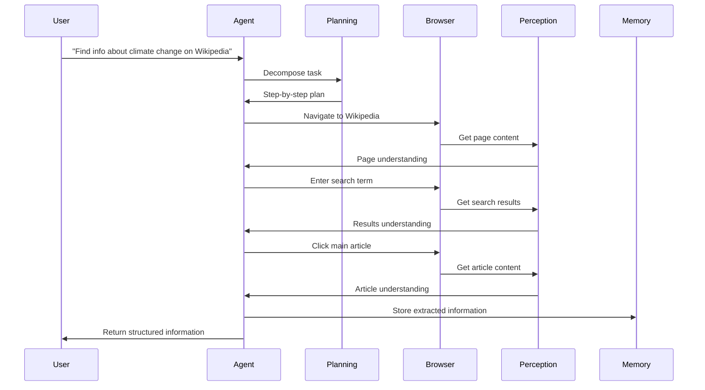
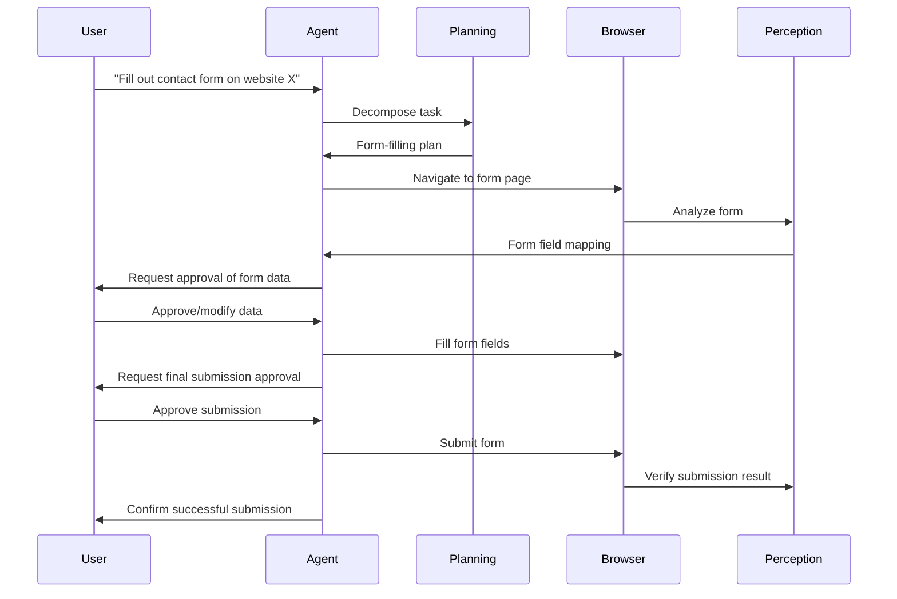
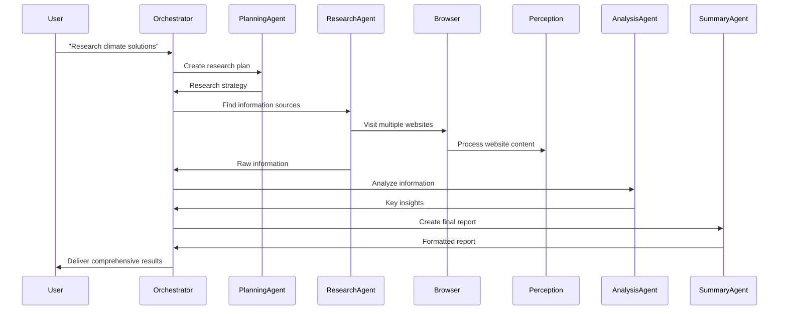

# Enhanced AI Agentic Browser Agent: Architecture Flow Guide

This document explains how the Enhanced AI Agentic Browser Agent processes tasks and automates web interactions in simple, understandable terms.

## How It Works: The Big Picture

## 1. User Submits a Task

The flow begins when a user submits a task to the agent. For example:
- "Search for information about climate change on Wikipedia"
- "Fill out this contact form with my details"
- "Extract product information from this e-commerce site"

The user can specify:
- Task description
- URLs to visit
- Whether human assistance is needed
- Timeouts and other parameters

## 2. Agent Orchestrator Takes Control

The Agent Orchestrator acts as the central coordinator and performs the following steps:

1. **Validates the task** by asking the Ethical Guardian: "Is this task allowed?"
2. **Creates a task record** with a unique ID for tracking
3. **Manages the entire lifecycle** of the task execution
4. **Coordinates communication** between all layers

## 3. Planning the Task (Planning & Reasoning Layer)

Before doing any browsing, the agent plans its approach:

1. **Task decomposition**: Breaks the high-level goal into specific actionable steps
   - "First navigate to Wikipedia homepage"
   - "Then search for climate change"
   - "Then extract the main sections..."

2. **Decision planning**: Prepares for potential decision points
   - "If search results have multiple options, choose the most relevant one"
   - "If a popup appears, close it and continue"

3. **Memory check**: Looks for similar tasks done previously to learn from past experiences

## 4. Browser Interaction (Browser Control Layer)

Once the plan is ready, the agent interacts with the web:

1. **Browser startup**: Opens a browser instance (visible or headless)
2. **Navigation**: Visits the specified URL
3. **Page interaction**: Performs human-like interactions with the page
   - Clicking on elements
   - Typing text
   - Scrolling and waiting
   - Handling popups and modals

## 5. Understanding Web Content (Perception & Understanding Layer)

To interact effectively with websites, the agent needs to understand them:

1. **Visual processing**: Takes screenshots and analyzes the visual layout
   - Identifies UI elements like buttons, forms, images
   - Recognizes text in images using OCR
   - Understands the visual hierarchy of the page

2. **DOM analysis**: Examines the page's HTML structure
   - Finds interactive elements
   - Identifies forms and their fields
   - Extracts structured data

3. **Content comprehension**: Uses AI to understand what the page is about
   - Summarizes key information
   - Identifies relevant sections based on the task

## 6. Taking Action (Action Execution Layer)

Based on its understanding, the agent executes actions:

1. **Browser actions**: Human-like interactions with the page
   - Clicking buttons
   - Filling forms
   - Scrolling through content
   - Extracting data

2. **API actions**: When more efficient, bypasses browser automation
   - Makes direct API calls
   - Retrieves data through services
   - Submits forms via POST requests

3. **Error handling**: Deals with unexpected situations
   - Retries failed actions
   - Finds alternative paths
   - Uses self-healing techniques to adapt

## 7. Human Collaboration (User Interaction Layer)

Depending on the mode, the agent may involve humans:

1. **Autonomous mode**: Completes the entire task without human input

2. **Review mode**: Works independently but humans review after completion

3. **Approval mode**: Asks for approval before executing key steps
   - "I'm about to submit this form with the following information. OK to proceed?"

4. **Manual mode**: Human provides specific instructions for each step

## 8. Learning from Experience (Memory & Learning Layer)

The agent improves over time by:

1. **Recording experiences**: Stores what worked and what didn't
   - Successful strategies
   - Failed attempts
   - User preferences

2. **Pattern recognition**: Identifies common patterns across similar tasks

3. **Adaptation**: Uses past experiences to handle new situations better

## 9. Multi-Agent Collaboration (A2A Protocol)

For complex tasks, multiple specialized agents can work together:

1. **Task delegation**: Breaking complex tasks into specialized sub-tasks
   - Research agent gathers information
   - Analysis agent processes the information
   - Summary agent creates the final report

2. **Information sharing**: Agents exchange data and insights

3. **Coordination**: Orchestrating the workflow between agents

## 10. Monitoring & Safety (Security & Monitoring Layers)

Throughout the process, the system maintains:

1. **Ethical oversight**: Ensures actions comply with guidelines
   - Privacy protection
   - Data security
   - Ethical behavior

2. **Performance tracking**: Monitors efficiency and effectiveness
   - Task completion rates
   - Processing times
   - Resource usage

3. **Error reporting**: Identifies and logs issues for improvement

## Flow Diagrams for Common Scenarios

### 1. Basic Web Search & Information Extraction

### 2. Form Filling with Human Approval

### 3. Multi-Agent Research Task

## Key Terms Simplified

- **Agent Orchestrator**: The central coordinator that manages the entire process
- **LFM (Large Foundation Model)**: Advanced AI that can understand text, images, etc.
- **DOM**: The structure of a webpage (all its elements and content)
- **API**: A direct way to communicate with a service without using the browser
- **Self-healing**: The ability to recover from errors and adapt to changes
- **Vector Database**: System for storing and finding similar past experiences

## Getting Started

To use the Enhanced AI Agentic Browser Agent:

1. **Define your task** clearly, specifying any URLs to visit
2. **Choose an operation mode** (autonomous, review, approval, or manual)
3. **Submit the task** via API, Python client, or web interface
4. **Monitor progress** in real-time
5. **Review results** when the task completes

For more detailed information, check the other documentation files in this repository.
