# Enhanced AI Agentic Browser Agent: Visual Flow Guide

This document provides visual representations of how the Enhanced AI Agentic Browser Agent processes tasks, making it easier to understand the system's flow.

## Core Architecture Visual Overview

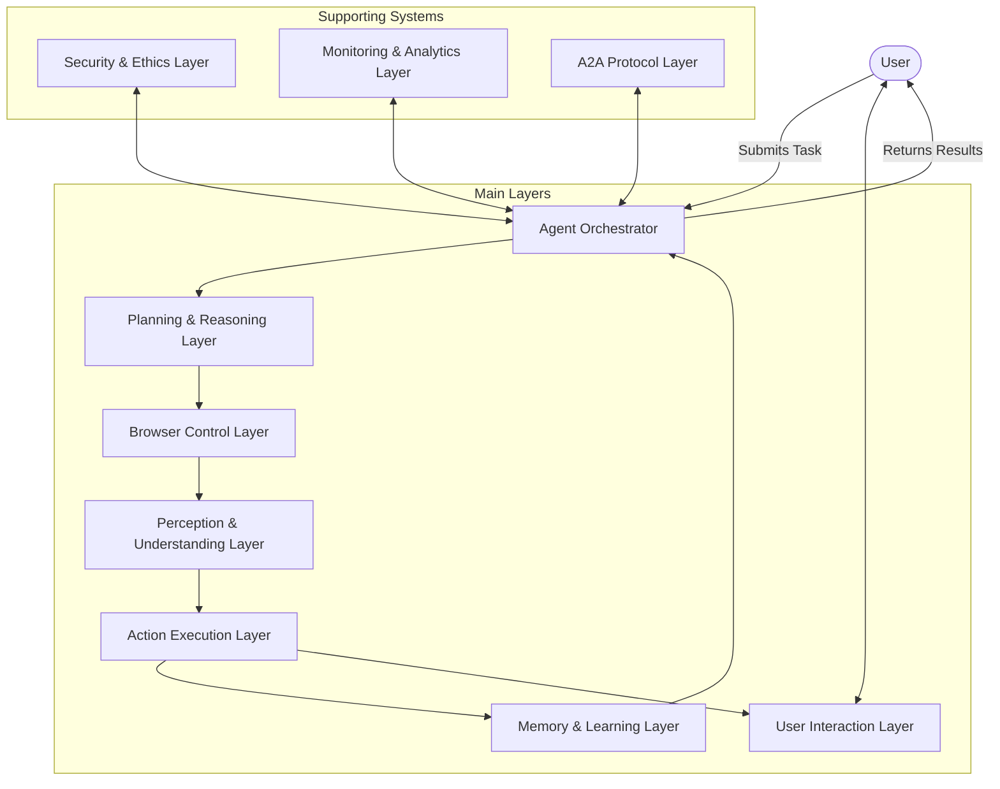

## Task Processing Flow

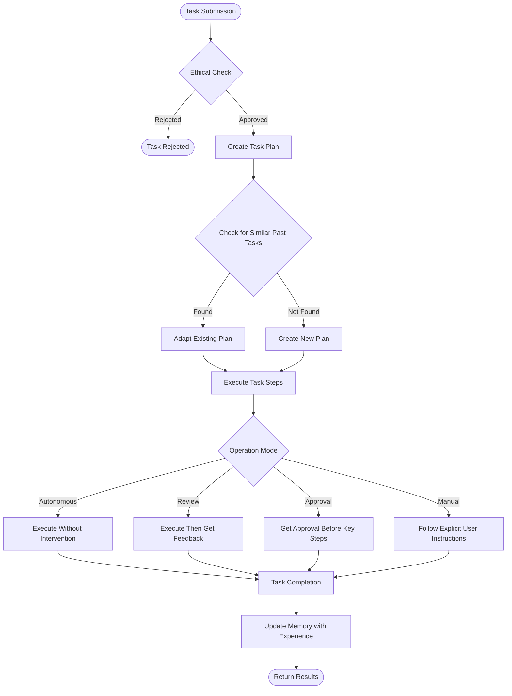

## Web Page Processing Flow

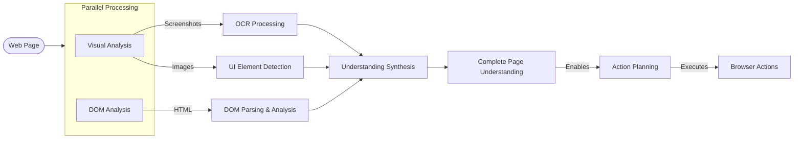

## Decision Making Process

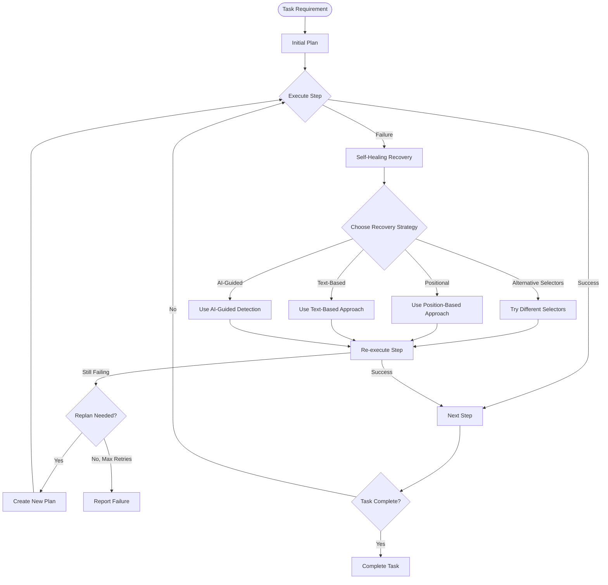

## Human-Agent Interaction Flow

```mermaid
sequenceDiagram
    participant User
    participant Orchestrator as Agent Orchestrator
    participant Executor as Hybrid Executor
    participant Browser
    
    User->>Orchestrator: Submit task with human_assist=true
    Orchestrator->>Executor: Process task in hybrid mode
    
    alt Approval Mode
        Executor->>User: Request approval for planned actions
        User->>Executor: Provide approval (or modifications)
        Executor->>Browser: Execute approved actions
    else Review Mode
        Executor->>Browser: Execute actions autonomously
        Executor->>User: Present results for review
        User->>Executor: Provide feedback
        Executor->>Orchestrator: Store feedback for learning
    else Manual Mode
        Executor->>User: Request specific instruction
        User->>Executor: Provide exact action details
        Executor->>Browser: Execute user-specified action
    end
    
    Browser->>Executor: Action results
    Executor->>Orchestrator: Update task status
    Orchestrator->>User: Deliver final results
```

## Multi-Agent Collaboration with A2A Protocol

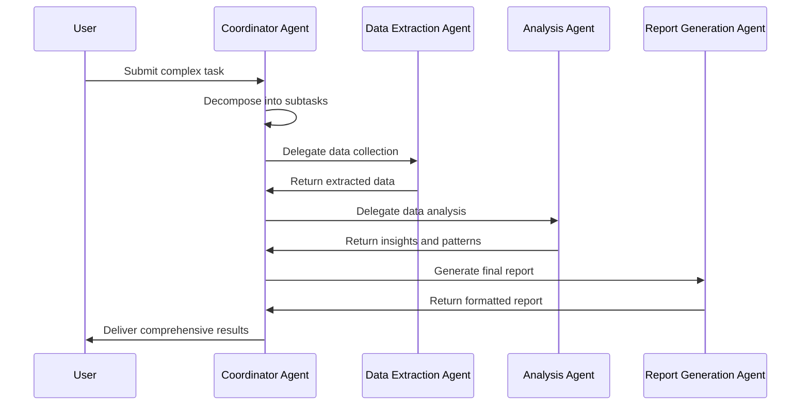

## Memory & Learning Process

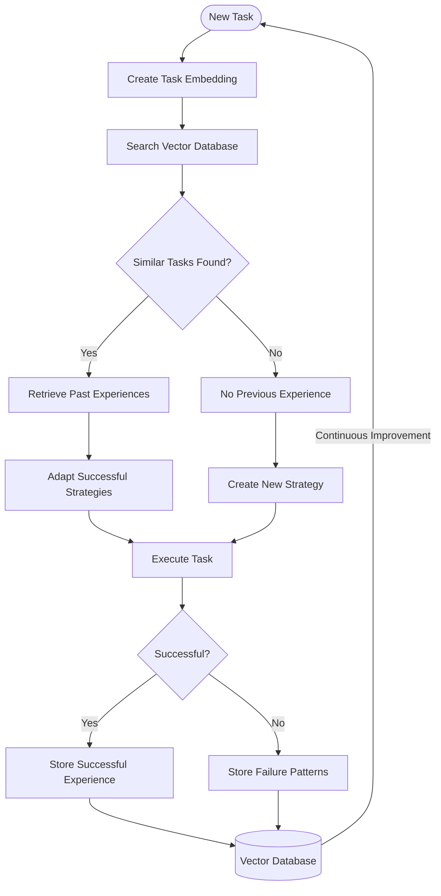

## Full Task Execution Timeline

```mermaid
gantt
    title Task Execution Timeline
    dateFormat  s
    axisFormat %S
    
    Task Request           :done,    req, 0, 1s
    Ethical Validation     :done,    val, after req, 1s
    Memory Lookup          :done,    mem, after val, 2s
    Planning & Decomposition:done,   plan, after mem, 3s
    
    section Browser Actions
    Navigation             :done,    nav, after plan, 2s
    Page Analysis          :done,    analysis, after nav, 3s
    Element Location       :active,  find, after analysis, 1s
    Action Execution       :         exec, after find, 2s
    
    section User Interaction
    Wait For Approval      :         approval, after exec, 3s
    Process User Input     :         input, after approval, 1s
    
    section Completion
    Result Compilation     :         compile, after input, 2s
    Store Experience       :         store, after compile, 1s
    Return Results         :         return, after store, 1s
```

## Data Flow Between Components

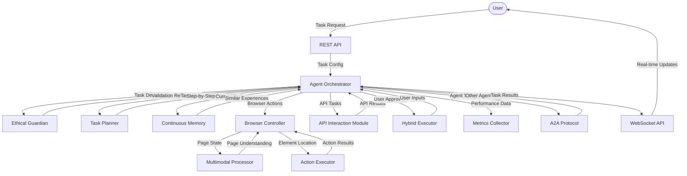

## Layer-Specific Flows

### Perception & Understanding Layer

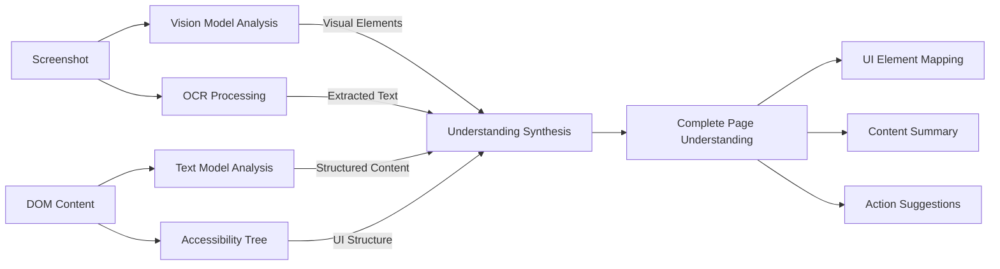

### Memory & Learning Layer

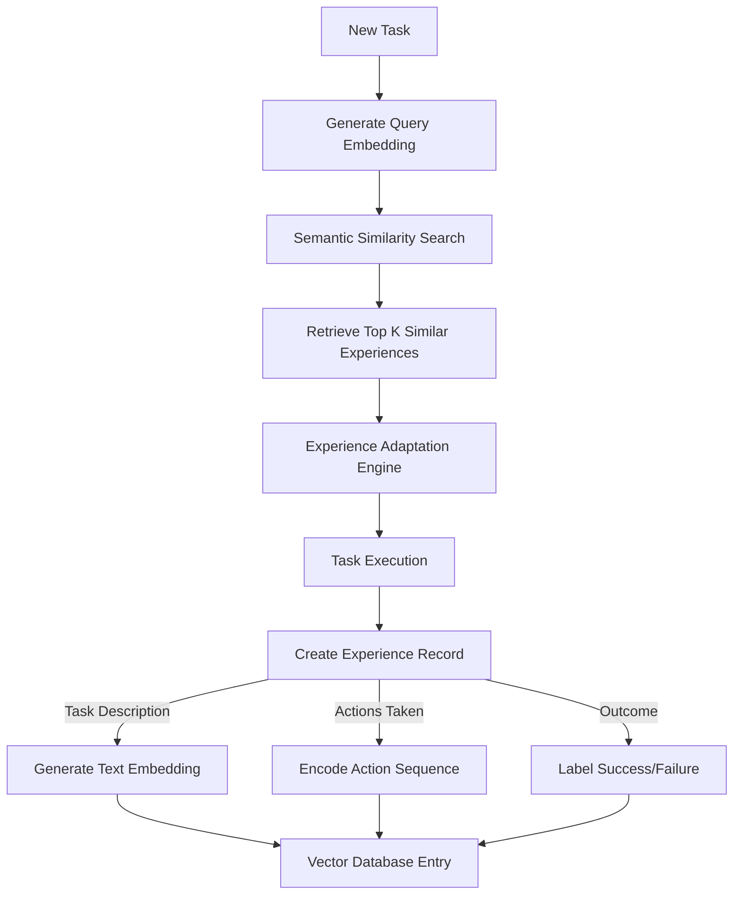
